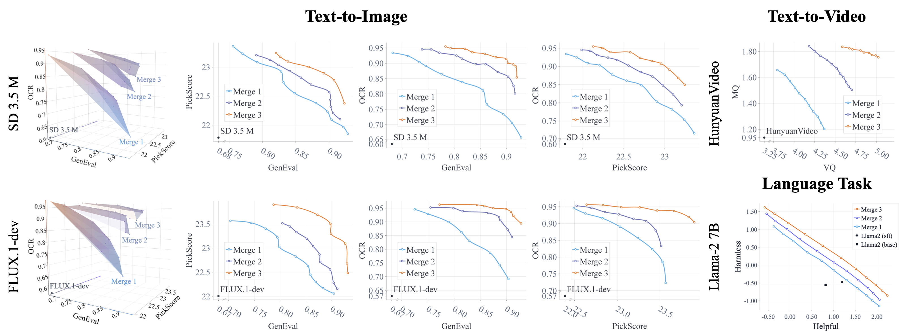
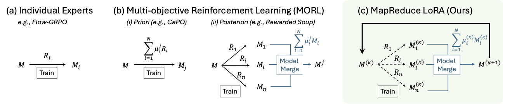
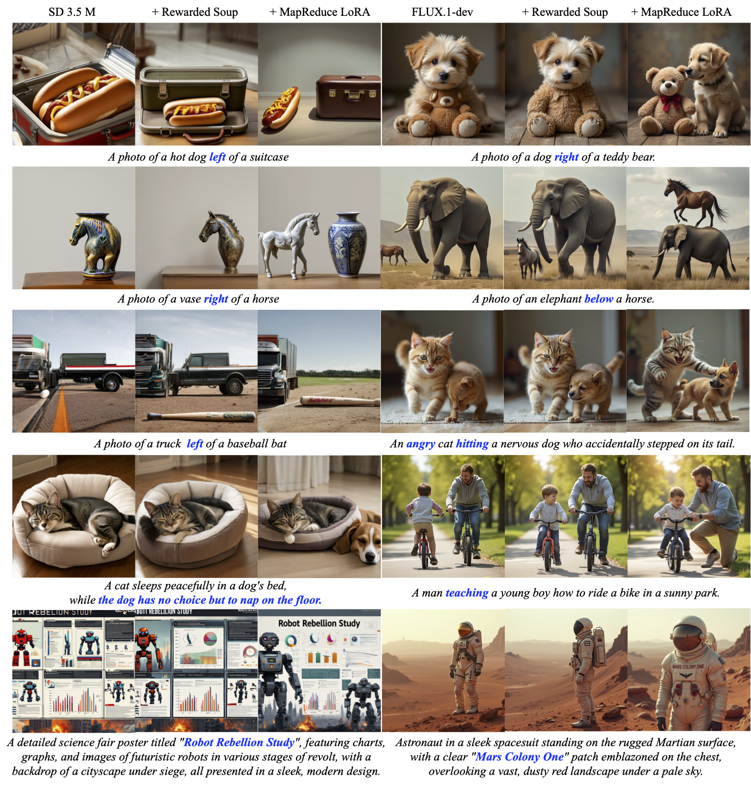
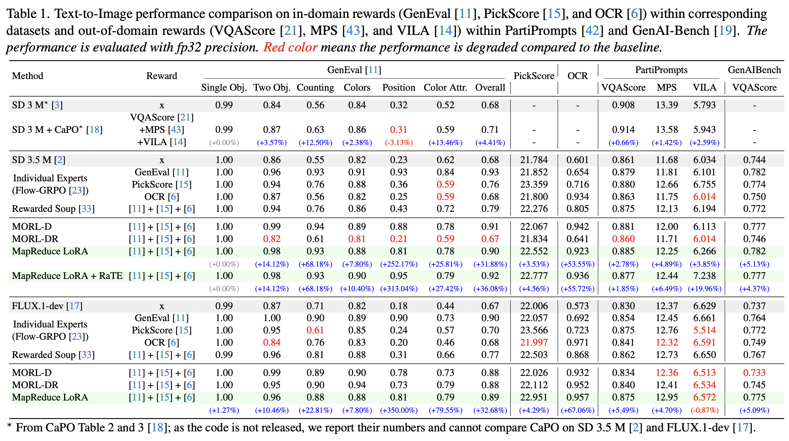
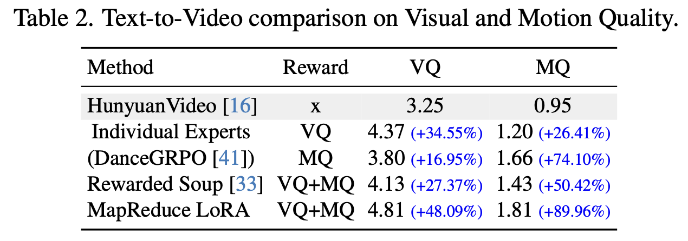
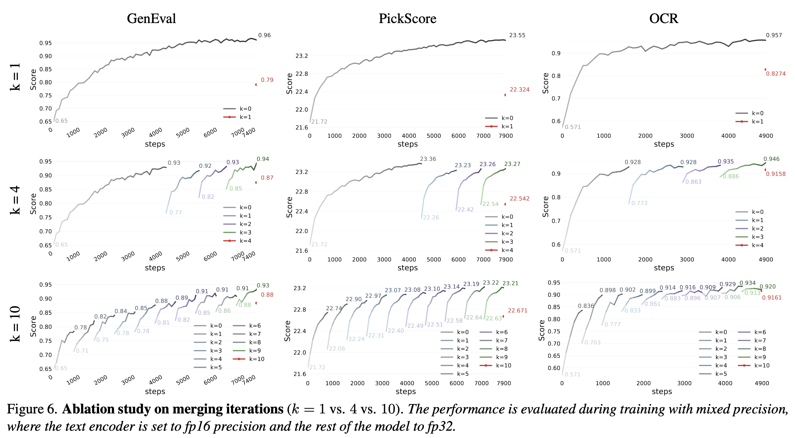
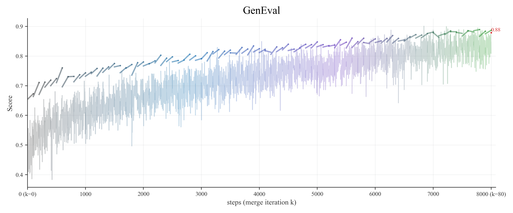
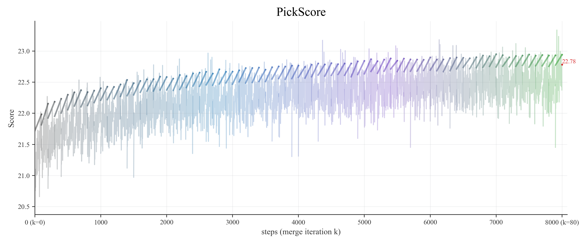
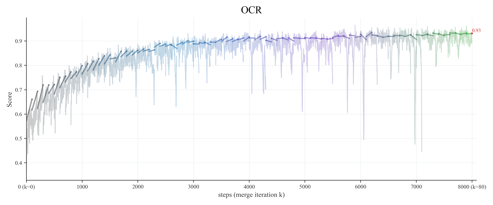
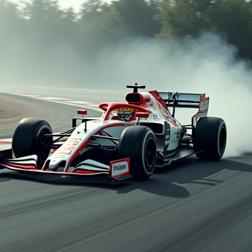

<h2 align="center">MapReduce LoRA: Advancing the Pareto Front in Multi-Preference Optimization for Generative Models</h2>

<p align="center">
Chieh-Yun Chen¹,
Zhonghao Wang²†,
Qi Chen²,
Zhifan Ye¹,
Min Shi¹,
Yue Zhao¹,<br>
Yinan Zhao²,
Hui Qu²,
Wei-An Lin²,
Yiru Shen²,
Ajinkya Kale²,
Irfan Essa¹,
Humphrey Shi¹†
</p>

<p align="center">
¹Georgia Tech &nbsp;&nbsp; ²Adobe &nbsp;&nbsp; †Corresponding authors<br>
<em>IEEE/CVF Conference on Computer Vision and Pattern Recognition (CVPR), 2026</em>
</p>

<div align="center">

[](https://arxiv.org/pdf/2511.20629) [](https://huggingface.co/collections/shi-labs/mapreduce-lora) [](https://github.com/SHI-Labs/T2I-Copilot/blob/master/LICENSE) [](#citation)

</div>


<p align="center">
    
</p>

- **Problem**: Multi-reward RLHF often suffers an alignment tax—improving one metric while degrading others.
- **Approach**: We introduce two complementary methods:
    <p align="center">
        
    </p>

    - **MapReduce LoRA**: train reward-specific LoRA experts in parallel (Map) and iteratively merge them (Reduce) with configurable weights (default 1:1:1).
    - **Reward-aware Token Embedding (RaTE)**: learn reward-aware token embeddings that compose at inference for flexible preference control.
- **Results**
    - Text-to-Image:
        - SD3.5M: +36.1% (GenEval), +4.6% (PickScore), +55.7% (OCR)
        - FLUX.1-dev: +32.7% (GenEval), +4.3% (PickScore), +67.1% (OCR)
    - Text-to-Video: 
        - HunyuanVideo +48.1% (visual), +90.0% (motion)
    - Language Task: 
        - Llama-2 7B: Helpful Assistant: +43.4% (helpful), +136.7% (harmless)


## 🎨 Qualitative Performance

<p align="center">
    
</p>


## 📊 Quantitative Performance
<p align="center">
    
</p>

<p align="center">
    
</p>

<!-- ### Ablation Study between merging iterations (k=1 vs. 4 vs. 10)

Increasing \(k\) consistently improves final performance and reduces degradation from merging multiple experts.

<p align="center">
    
</p> -->

## 🚀 Quickstart: 

### 0. Environment Setup

Clone this repo and install environments

```bash
# Pre-download the models to prevent repeatedly download the model from huggingface
huggingface-cli login
huggingface-cli download stabilityai/stable-diffusion-3.5-medium
huggingface-cli download black-forest-labs/FLUX.1-dev

# login wandb
wandb login

# install the conda environment
conda create -n mapreduce-lora python=3.12 -y
conda activate mapreduce-lora
pip install diffusers==0.33.1
pip install torch==2.6.0
pip install transformers==4.54.0
pip install protobuf==5.29.5
pip install sentencepiece==0.2.0
pip install accelerate==1.9.0
pip install --no-cache-dir -U packaging ninja==1.11.1.4
pip install flash-attn==2.8.0.post2 --no-build-isolation --no-cache-dir
pip install xformers==0.0.31.post1
pip install absl-py==2.3.1
pip install ml_collections==1.1.0
pip install wandb==0.18.7
pip install peft==0.10.0
# NOTE: for deepspeed
pip install deepspeed==0.17.2
# NOTE: for paddleocr
pip install paddlepaddle-gpu==2.6.2
pip install paddleocr==2.9.1
pip install python-Levenshtein==0.27.1
```

Pre-download the PaddelOCR model
```python
from paddleocr import PaddleOCR
ocr = PaddleOCR(use_angle_cls=False, lang="en", use_gpu=False, show_log=False)
```

Prepare the geneval reward: follow [reward-server](https://github.com/yifan123/reward-server) to install the conda environment for geneval; pickscore and ocr are already included in mapreduce-lora conda env

### 1. MapReduce LoRA on Text-to-Image (SD35m and FLUX.1-dev)

The parallel automation trains three reward experts (GenEval / PickScore / OCR) in parallel and periodically merges their LoRAs with configurable weights (default 1:1:1). The merged adapter is then used to resume the next cycle.

### Train MapReduce LoRA Automatically
- The script automatically derives the parallel topology from your environment (e.g., scheduler-provided `RANK`/`WORLD_SIZE` or reachable nodes) and assigns nodes in groups of `NODES_PER_TASK` to the three experts (GenEval, PickScore, OCR).
- By default it uses `NODES_PER_TASK=4`, `GPUS_PER_NODE=8`, `MERGE_STEPS=100`, and `CYCLES=80`. With 12 nodes available this yields a 12-node run (4 per expert). Distinct ports are used per expert: `MASTER_PORT`, `MASTER_PORT+1`, `MASTER_PORT+2`.

Minimal run (uses script defaults):
```bash
# simultaneously train 3 jobs, including GenEval, PickScore and OCR
# sd35m
bash scripts/init_scripts/init_parallel_sd35m.sh
# flux.1-dev 
bash scripts/init_scripts/init_parallel_flux.sh

# if there is limited GPU nodes, we can train 3 jobs sequentially: GenEval -> PickScore -> OCR -> GenEval -> ...
bash scripts/init_scripts/init_sequential.sh
```

Override common knobs as needed (example):
```bash
export CYCLES=5
export MERGE_STEPS=200
export WEIGHTS="1 1 1"          # merge weights: GenEval PickScore OCR
export NODES_PER_TASK=4
export GPUS_PER_NODE=8
export MASTER_ADDR=127.0.0.1     # base address; groups use derived ports
export MASTER_PORT=9998

# sd35m
bash scripts/init_scripts/init_parallel_sd35m.sh
# flux.1-dev
bash scripts/init_scripts/init_parallel_flux.sh
```

**Adjustable parameters**
- **CYCLES**: total merge cycles.
- **MERGE_STEPS**: steps per expert before each merge (default: 100).
- **WEIGHTS**: merge weights for GenEval, PickScore, OCR (e.g., `1 1 1`).
- **NODES_PER_TASK**, **GPUS_PER_NODE**: nodes and GPUs per expert group.
- **MASTER_ADDR**, **MASTER_PORT**: base rendezvous; experts use `PORT`, `PORT+1`, `PORT+2`.
- **WORLD_SIZE**/**RANK** or **NODE_IPS**: scheduler-provided topology or static IPs.
- **LOG_DIR**, **OUT_ROOT**: logs root and merged outputs root.
- **PRETRAINED_MODEL_PATH** (script default), **MODEL_PATH** (optional local base model).
- **Auto Resume**: Set `AUTO_RESUME=1`, `SKIP_COMPLETED_TASKS=1`, and Specify `RESUME_RUN_TS`.
- **Reward/Coordination**: **START_GENEVAL_REWARD**, **STOP_GENEVAL_REWARD_AFTER**, **MERGE_COORD_RANK**.


SD 3.5 M training (the continuous one) and eval curves with fixed merging steps 100 for all rewards (k=80)

<p align="center">
    
</p>

<p align="center">
    
</p>

<p align="center">
    
</p>


### Train MapReduce LoRA Manually

Since different rewards may work better at different training steps, we can train each expert independently and merge their LoRAs manually.

```bash
# Train individual experts (Defaults to GenEval. For PickScore/OCR, update `init_manually_mapreduce_${model_name}.sh`)
model_name="sd35m" #flux

bash scripts/init_scripts/init_manually_mapreduce_${model_name}.sh
# Merge
python scripts/merge_scripts/merge_lora.py --model_name "${model_name} "--lora_paths "${GEN_LORA}" "${PICK_LORA}" "${OCR_LORA}" --weights ${WEIGHTS} --output_dir "${MERGE_OUT}"
```

SD 3.5 M eval curves with independent merging step for each reward

<p align="center">
    
</p>


### Inference with pre-trained weights

SD3.5M
<div align="center"> a photo of a suitcase right of a boat </div>

<table>
  <colgroup>
    <col width="25%">
    <col width="25%">
    <col width="25%">
    <col width="25%">
  </colgroup>
  <tr>
    <td></td>
    <td></td>
    <td></td>
    <td></td>
  </tr>
  <tr>
    <td align="center"><sub>GenEval</sub></td>
    <td align="center"><sub>PickScore</sub></td>
    <td align="center"><sub>OCR</sub></td>
    <td align="center"><sub>MPR (Ours)</sub></td>
  </tr>
</table>

FLUX.1-dev

<div align="center"> Side-profile panning shot of an anthropomorphic tiger driving a high-speed Formula 1 car, sleek aerodynamic body, <span style="color:#DA6549; font-weight:600;">'MapReduce LoRA'</span> clearly printed on the side livery, major F1 circuit, tire smoke, strong motion blur in the background, sharp focus on the car, cinematic lighting, realistic motorsport photography. </div>

<table>
  <colgroup>
    <col width="25%">
    <col width="25%">
    <col width="25%">
    <col width="25%">
  </colgroup>
  <tr>
    <td></td>
    <td></td>
    <td></td>
    <td></td>
  </tr>
  <tr>
    <td align="center"><sub>GenEval</sub></td>
    <td align="center"><sub>PickScore</sub></td>
    <td align="center"><sub>OCR</sub></td>
    <td align="center"><sub>MPR (Ours)</sub></td>
  </tr>
</table>

```bash
model_name="sd35" #flux
model_ckpt="SD3.5M" #FLUX.1-dev

# inference with individual experts GenEval 
python scripts/test_${model_name}.py --mode eval_single --use_adapter --lora_checkpoint "shi-labs/${model_ckpt}-ind-expert-GenEval" --results_dir "results/ind-geneval/"

# inference with individual experts PickScore 
python scripts/test_${model_name}.py --mode eval_single --use_adapter --lora_checkpoint "shi-labs/${model_ckpt}-ind-expert-PickScore" --results_dir "results/ind-pickscore/"

# inference with individual experts OCR 
python scripts/test_${model_name}.py --mode eval_single --use_adapter --lora_checkpoint "shi-labs/${model_ckpt}-ind-expert-OCR" --results_dir "results/ind-ocr/"

# inference with MapReduce-LoRA
python scripts/test_${model_name}.py --mode eval_single --use_adapter --lora_checkpoint "shi-labs/${model_ckpt}-MapReduce-LoRA-merge-k4" --results_dir "results/mpr/"
```

### 2. Reward-aware Token Embedding on Text-to-Image

```bash
# Defaults to GenEval. For PickScore/OCR, update `init_RaTE_sd35m.sh`
# Before start, update `config.teacher_lora_dir` in `config/sft_ti.py`.
bash scripts/init_scripts/init_RaTE_sd35m.sh
```


## 🙏 Acknowledgements
We gratefully acknowledge the generous contributions of the open-source community, especially the teams behind **[Stable Diffusion 3.5](https://huggingface.co/stabilityai/stable-diffusion-3.5-medium)**, **[FLUX.1-dev](https://huggingface.co/black-forest-labs/FLUX.1-dev)**, **[HunyuanVideo](https://huggingface.co/hunyuanvideo-community/HunyuanVideo)**, **[Llama](https://ai.meta.com/research/publications/llama-2-open-foundation-and-fine-tuned-chat-models/)**, **[Flow-GRPO](https://github.com/yifan123/flow_grpo)**, **[DanceGRPO](https://github.com/XueZeyue/DanceGRPO)**, **[GenEval](https://github.com/djghosh13/geneval)**, **[PickScore](https://huggingface.co/yuvalkirstain/PickScore_v1)**, **[PaddleOCR](https://github.com/PaddlePaddle/PaddleOCR)**, **[VQAScore](https://github.com/linzhiqiu/t2v_metrics)**, **[MPS](https://github.com/Kwai-Kolors/MPS)**, **[VILA](https://github.com/google-research/google-research/tree/master/vila)**, and **[VideoAlign](https://github.com/KlingTeam/VideoAlign/tree/main)**. Their publicly available code and models made this work possible.


## 📖 Citation
If you find this work useful, please cite:

```bibtex
@inproceedings{chen2026mapreducelora,
  title        = {MapReduce LoRA: Advancing the Pareto Front in Multi-Preference Optimization for Generative Models},
  author       = {Chieh-Yun Chen and Zhonghao Wang and Qi Chen and Zhifan Ye and Min Shi and Yue Zhao and Yinan Zhao and Hui Qu and Wei-An Lin and Yiru Shen and Ajinkya Kale and Irfan Essa and Humphrey Shi},
  booktitle    = {Proceedings of the {IEEE/CVF} Conference on Computer Vision and Pattern Recognition ({CVPR})},
  year         = {2026}
}
```
